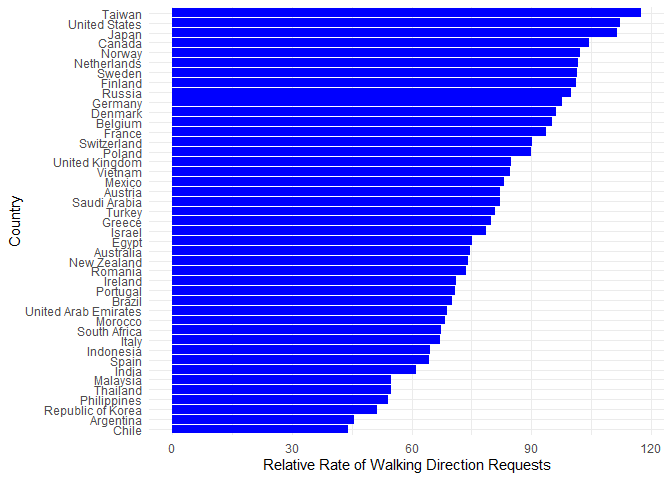
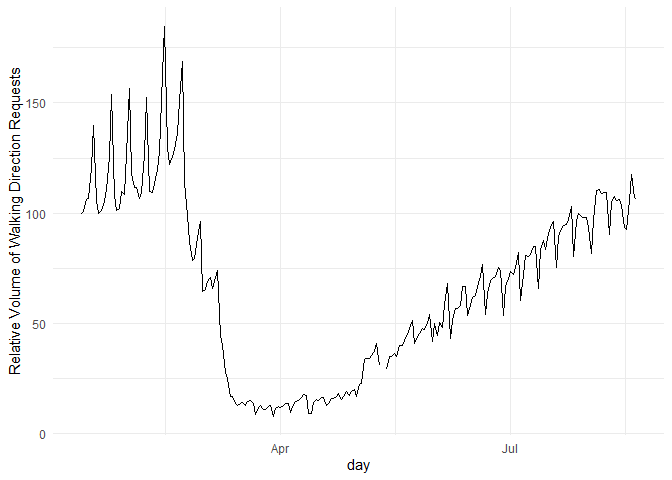
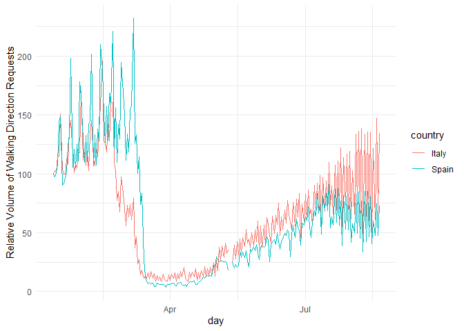
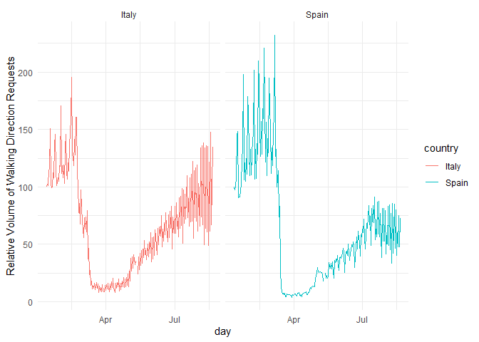

SICSS: R Bootcamp
================
Irina Valenzuela
6/16/2022

# R Bootcamp

## 1. Setting

#### Install Packages

``` r
install.packages('tidyverse') # Data Manipulation, includes ggplot2
```

#### Loading Libraries

``` r
library(tidyverse)
```

## 2. Data Wrangling (Cleaning)

#### 2.1 Load data

Apple mobility data: How far people are going during COVID-19 crisis.

``` r
load("Apple_Mobility_Data.Rdata")
ls() # Show dataframes
```

    ## [1] "apple_data"

``` r
head(apple_data,4)
```

    ## # A tibble: 4 x 227
    ##   geo_type       region   transportation_~ alternative_name `sub-region` country
    ##   <chr>          <chr>    <chr>            <chr>            <chr>        <chr>  
    ## 1 country/region Albania  driving          <NA>             <NA>         <NA>   
    ## 2 country/region Albania  walking          <NA>             <NA>         <NA>   
    ## 3 country/region Argenti~ driving          <NA>             <NA>         <NA>   
    ## 4 country/region Argenti~ walking          <NA>             <NA>         <NA>   
    ## # ... with 221 more variables: `2020-01-13` <dbl>, `2020-01-14` <dbl>,
    ## #   `2020-01-15` <dbl>, `2020-01-16` <dbl>, `2020-01-17` <dbl>,
    ## #   `2020-01-18` <dbl>, `2020-01-19` <dbl>, `2020-01-20` <dbl>,
    ## #   `2020-01-21` <dbl>, `2020-01-22` <dbl>, `2020-01-23` <dbl>,
    ## #   `2020-01-24` <dbl>, `2020-01-25` <dbl>, `2020-01-26` <dbl>,
    ## #   `2020-01-27` <dbl>, `2020-01-28` <dbl>, `2020-01-29` <dbl>,
    ## #   `2020-01-30` <dbl>, `2020-01-31` <dbl>, `2020-02-01` <dbl>, ...

#### 2.2 Let’s start

Let’s start by isolating only the data that corresponds to Brazil

``` r
# Apply a filter. 
# Filter on region variable equal Brazil. This subset of data will be a new object called brazil_data

brazil_data <- filter(apple_data, region=="Brazil")
```

Breaking the data set into smaller part. We want the column “region”.
Then we use the option Select to choose column from a dataframe, and
create a new object called regions

``` r
regions <- select(apple_data, region)
```

``` r
transport_types <- count(apple_data, transportation_type)

# Arrange: sort dataframe. For example arrange/sort by region

alpha_order <- arrange(apple_data, region)
```

Reshaping data Instead of having many columns for different dates. We
want one column with the data, and another with the values. We will use
the function gather

``` r
# Gather function. New dataset, instead of having lot of columns (date columns), we are going to have lof of rows.  

# key = the name assigned to date variables (dates in our case) , value= new variable we will create. Then, tell the range of variables

# Dates in R: `first date variable`:`last date variable to use`

long_apple_data <- gather(apple_data, key=day, value=mobility_data, `2020-01-13`:`2020-08-20` )

# Now, instead of having 3524 rows and 227 variables, now long_apple_data has 801125 rows and 8 variables (columns)

# Now, we can run simple calculations
```

## 3. Visualization

#### 3.1 Load data

``` r
apple_data2<-read_csv("apple_mobility_data.csv")
```

#### 3.2 Wrangling data

Reshape the data to be a long data

``` r
long_data<- gather(apple_data2, key=day, value=mobility_data, `2020-01-13`:`2020-08-20`)
```

Pipe: %>% It will pass whatever is one line to the other one.

``` r
country_average <- long_data %>% 
              filter(transportation_type=="walking") %>% 
# We want aggregate the data within a country
  group_by(country) %>% 
    summarise(walking_average=mean(mobility_data))

# Problem: Running the previous code, we will find that there are values "NA". This is because of missing values.

# We add ignore missinig values: na.rm=TRUE

country_average <- long_data %>% 
              filter(transportation_type=="walking") %>% 
  group_by(country) %>% 
    summarise(walking_average=mean(mobility_data, na.rm=TRUE)) %>% 
  # !is.na(country): keep those things that are not (!) missing values in the country variables
  filter(!is.na(country))
```

#### 3.3 Visualization

``` r
#Ggplot works with layers

# Order countries according the value of walking_average: reorder(country, walking_average)
ggplot(country_average, aes(y=reorder(country, walking_average), weight=walking_average)) +
  geom_bar(fill="blue") + #Color the bar with "fill"
  xlab("Relative Rate of Walking Direction Requests") +
  ylab("Country") +
  theme_minimal()
```

<!-- -->

lubridate: packaeg to transfor a character variable to date

``` r
# Load lubridate library
library(lubridate)

# Transform a date style object
long_data$day <- as_date(long_data$day)

# Create a aggregate data by day for Italy
italy_data<- long_data %>% 
  filter(country=="Italy", transportation_type=="walking") %>% 
  group_by(country, day) %>% 
  summarise(walking_average=mean(mobility_data, na.rm=TRUE))

#Plot

ggplot(italy_data,aes(x=day, y=walking_average)) +
  geom_line()+
  theme_minimal()+
  ylab("Relative Volume of Walking Direction Requests")
```

<!-- -->

International Comparison. Using a vector a countries: c(“Italy,”Spain”)

``` r
italy_spain_data<- long_data %>% 
  filter(country==c("Italy","Spain"), transportation_type=="walking") %>% 
  group_by(country, day) %>% 
  summarise(walking_average=mean(mobility_data, na.rm=TRUE))

#Plot

ggplot(italy_spain_data,aes(x=day, y=walking_average, group=country, colour=country)) +
  geom_line()+
  theme_minimal()+
  ylab("Relative Volume of Walking Direction Requests")
```

<!-- -->

``` r
# Facet: multiple plots

ggplot(italy_spain_data,aes(x=day, y=walking_average, group=country, colour=country)) +
  geom_line()+
  facet_wrap(~country)+ #facet: organize by country
  theme_minimal()+
  ylab("Relative Volume of Walking Direction Requests")
```

<!-- -->
